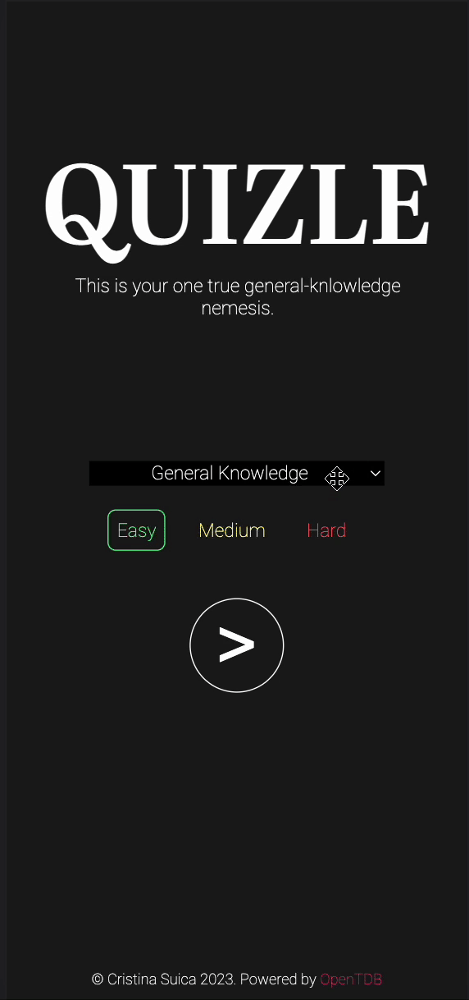

### _Single Page Application_

📱💻 → [Click here to try it out](https://yupseth.github.io/quiz-single-page-app/)

> This project was designed as a learning environment, in the light of the recently acquired understanding of web development fundamentals.

## About

QUIZLE is a responsive single page web application using HTML, CSS and vanilla JS. It relies on JavaScript to fetch the quiz questions and answers, assess the latter's suitability, and accordingly keep the user’s score. Once exhausting the ten multiple choice questions, it displays the final result.

Please consider that the content of this app (categories, questions and answers, along with their truth value) is exclusively dependent on the [Open Trivia Database API](https://opentdb.com). Hence the possibility of unavailable questions for certain categories and difficulty levels, or even inaccuracy of expression and correctness.

## Tutorial

- Choose one of the provided categories
- Select the difficulty level using the difficulty slider or the corresponding buttons, then press start
- Once selected an answer, a visual feedback is given with respect to its validity
- The next button advances to next questions, respectively to the result.
- The reset button brings the user back to the home screen.

## Demo

## Personal Objective

As mentioned before, this quiz was meant to serve as a facilitating environment for internalising the key concepts of web development.

Following the completion of several tutorials, I found myself in a position of becoming familiar with considerable amounts of new concepts, but not quite comfortable with a more hands-on approach of using them.

Thus, Quizle came as a pretext of getting more comfortable with API calls, DOM manipulation, and overall the entire process of creating a fully functional application.

### Challanges

As a self-taught web developer, there was no scarcity of challenges throughout the development processes of this project. However, they concluded in a set of **_valuable knowledge aquisitions_**:

#### JavaScript:

- Understanding how API calls work
- Improving the understanding of manipulating large collections of data
- Managing to alternate between different stages of game-play in a single page app
- Populating the dropdown options using DOM manipulation
- Generating answer buttons with predictable behaviour using DOM manipulation

#### CSS:

- Implementing a way of hiding the irrelevant screens in accordance with the game-stage
- Displaying consistent (and responsive) styles for desktop, tablet, and mobile screens
- Creating custom difficulty slider
- Creating an animated loader

#### Git:

- Working with local and remote branches

## License

**MIT**
Copyright (c) 2023 Cristina Șuică

Permission is hereby granted, free of charge, to any person obtaining a copy of this software and associated documentation files (the "Software"), to deal in the Software without restriction, including without limitation the rights to use, copy, modify, merge, publish, distribute, sublicense, and/or sell copies of the Software, and to permit persons to whom the Software is furnished to do so, subject to the following conditions:

The above copyright notice and this permission notice shall be included in all
copies or substantial portions of the Software.

THE SOFTWARE IS PROVIDED "AS IS", WITHOUT WARRANTY OF ANY KIND, EXPRESS OR
IMPLIED, INCLUDING BUT NOT LIMITED TO THE WARRANTIES OF MERCHANTABILITY,
FITNESS FOR A PARTICULAR PURPOSE AND NONINFRINGEMENT. IN NO EVENT SHALL THE
AUTHORS OR COPYRIGHT HOLDERS BE LIABLE FOR ANY CLAIM, DAMAGES OR OTHER
LIABILITY, WHETHER IN AN ACTION OF CONTRACT, TORT OR OTHERWISE, ARISING FROM,
OUT OF OR IN CONNECTION WITH THE SOFTWARE OR THE USE OR OTHER DEALINGS IN THE
SOFTWARE.
